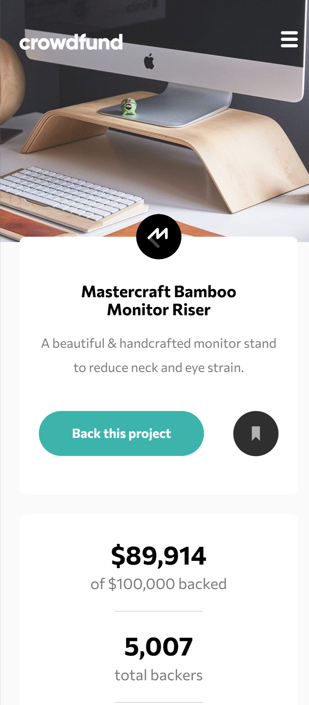
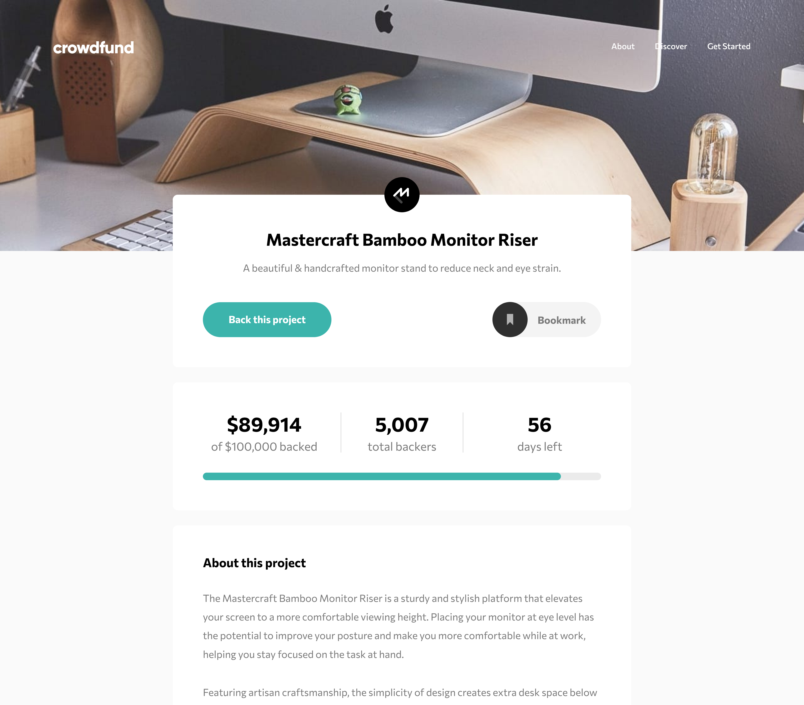

# Frontend Mentor - Crowdfunding product page solution

This is a solution to the [Crowdfunding product page challenge on Frontend Mentor](https://www.frontendmentor.io/challenges/crowdfunding-product-page-7uvcZe7ZR). Frontend Mentor challenges help you improve your coding skills by building realistic projects.

## 📑 Table of contents

- [Overview](#overview)
  - [The challenge](#the-challenge)
  - [Screenshot](#screenshot)
  - [Links](#links)
- [My process](#my-process)
  - [Built with](#built-with)
  - [Useful resources](#useful-resources)
- [Author](#author)

## Overview

### 💪 The challenge

Users should be able to:

- View the optimal layout depending on their device's screen size
- See hover states for interactive elements
- Make a selection of which pledge to make
- See an updated progress bar and total money raised based on their pledge total after confirming a pledge
- See the number of total backers increment by one after confirming a pledge
- Toggle whether or not the product is bookmarked

### 📸 Screenshot

|                                               Mobile                                                |                                                Desktop                                                |
| :-------------------------------------------------------------------------------------------------: | :---------------------------------------------------------------------------------------------------: |
|  |  |

### 🔗 Links

## My process

### Built with

- Semantic HTML5 markup
- CSS custom properties
- CSS Flexbox
- CSS Grid

### Useful resources

- [Pure CSS Custom Styled Radio Buttons](https://moderncss.dev/pure-css-custom-styled-radio-buttons/) - The guide on [moderncss.dev](https://moderncss.dev) helped me learn how to fully customize radio buttons using pure CSS, without losing accessibility or native functionality. It showed how to hide the default radio input while using **:checked**, **:focus**, and **:hover** states to style custom visuals, ensuring keyboard and screen reader support remained intact.

- [Professional CSS: Build a Website from Scratch](https://frontendmasters.com/courses/pro-css/) - After completing this course by Kevin Powell, I leveraged key concepts in this project, such as component-based styling, cascade layers, and creating smooth transitions.

## Author

